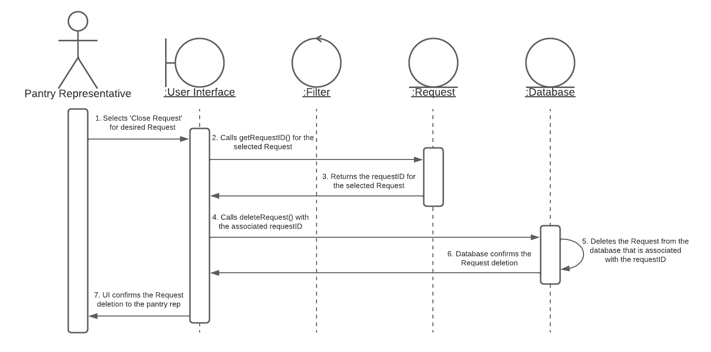

# System Sequence Diagrams
[< Back to `readme.md`](../../readme.md)

The system sequence diagrams show the overall 'flow' of interaction between classes over time in a system. The relationships between classes is again emphasized, making it clear how much time each class remains active for relative to the operation of the system.

## Creating a Request

## Updating a Request

## Deleting a Request

## Searching for a Request with Filters
