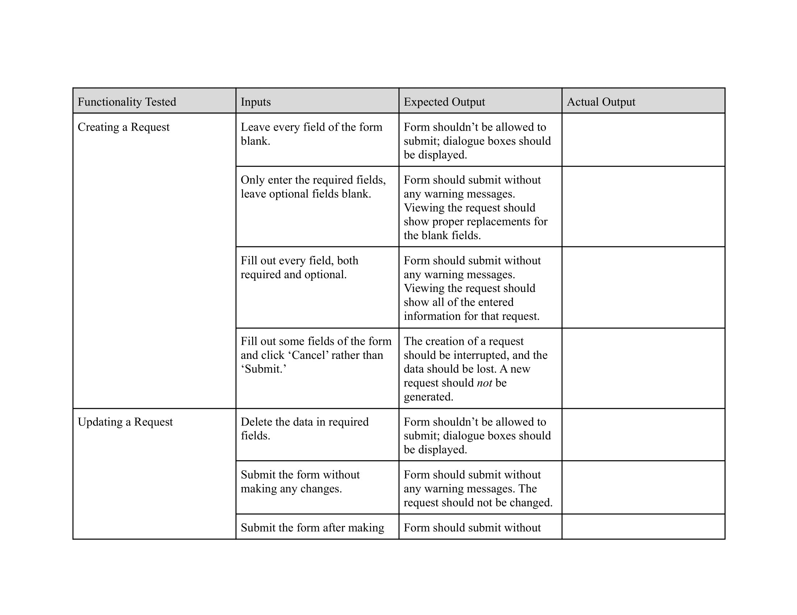
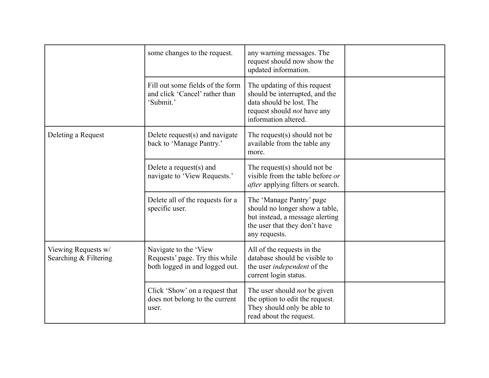
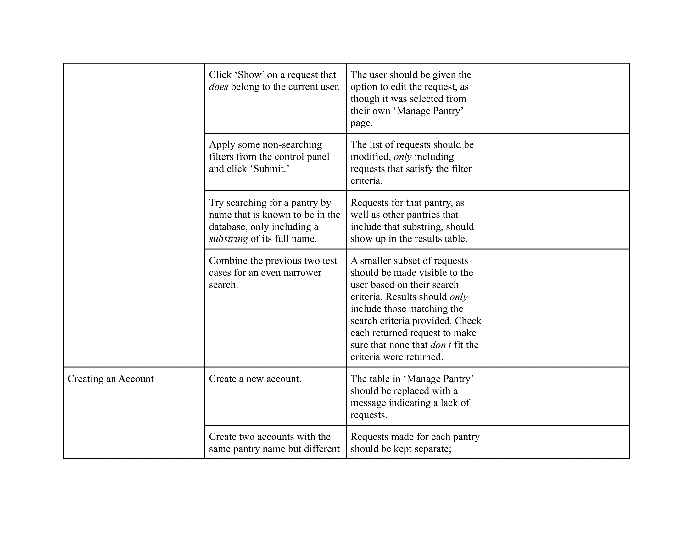
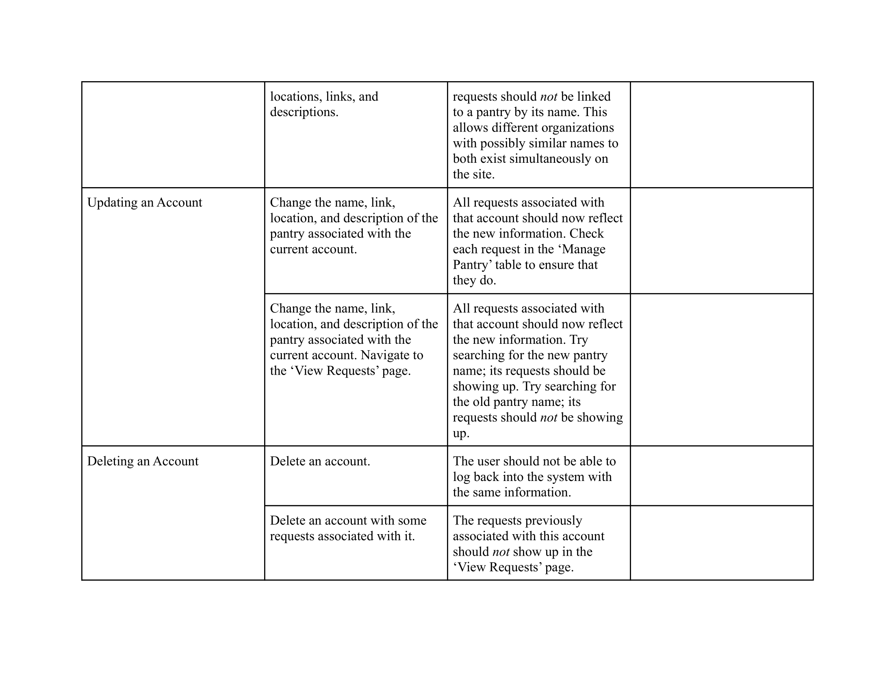
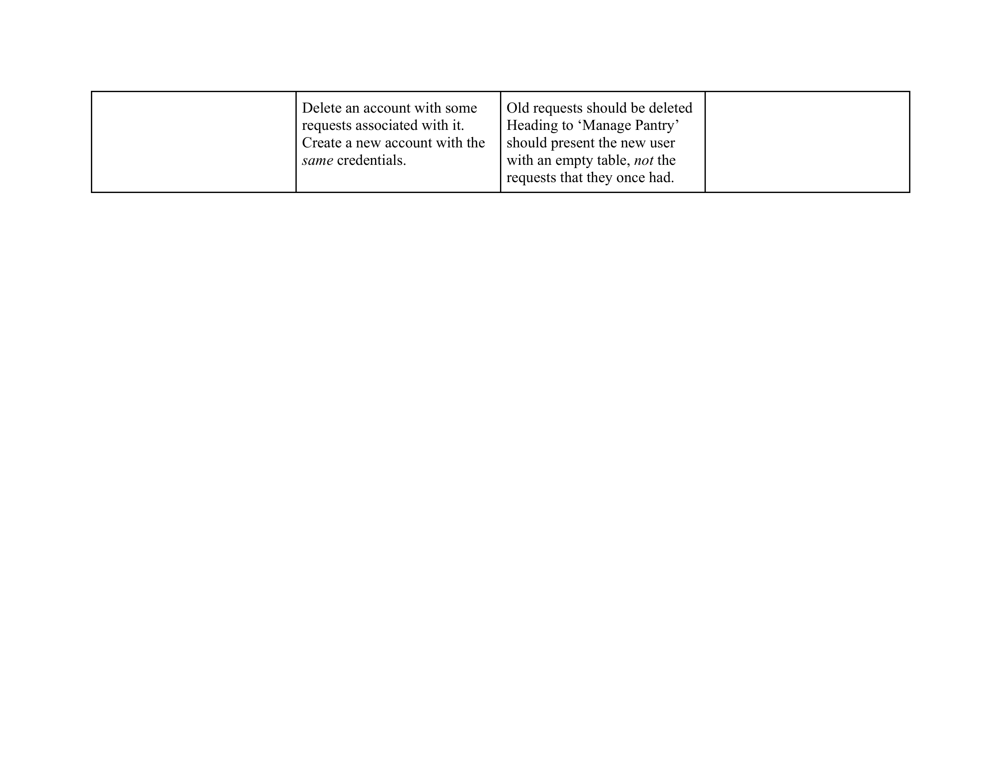

# Testing and Test Cases
[< Back to `readme.md`](../../readme.md)

Any good application requires good testing, and Pantry Packer is no different. Below are the initial set of test cases that seek to test the integrity of the major functions of my application. This list will likely grow as the semester progresses, but serves as a good start with the functionality currently implemented.

