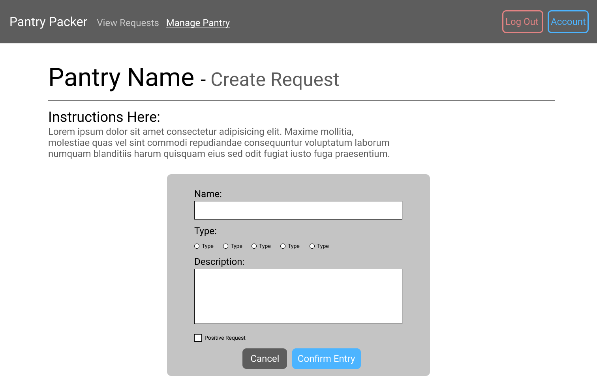
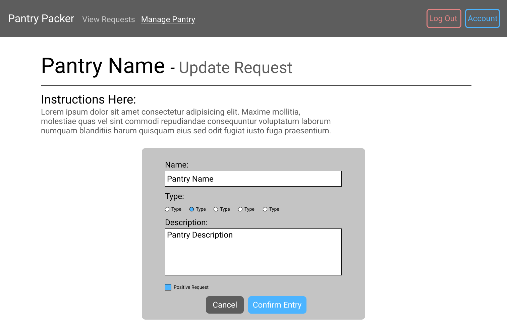
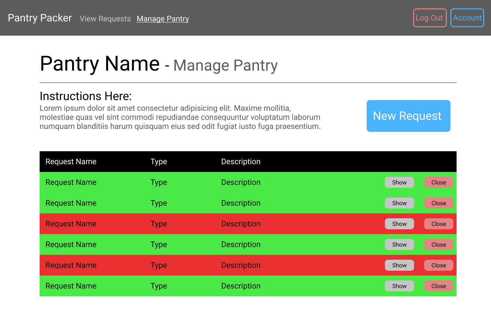
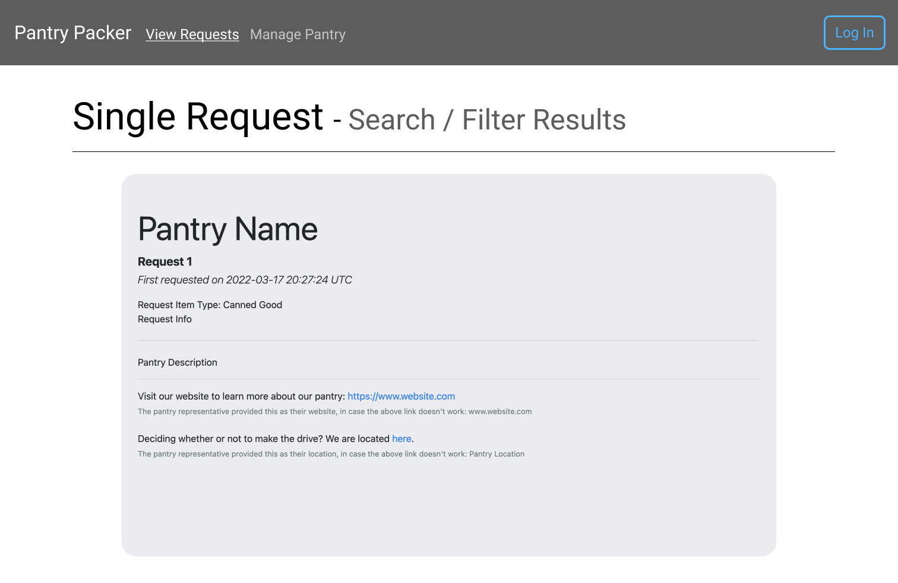
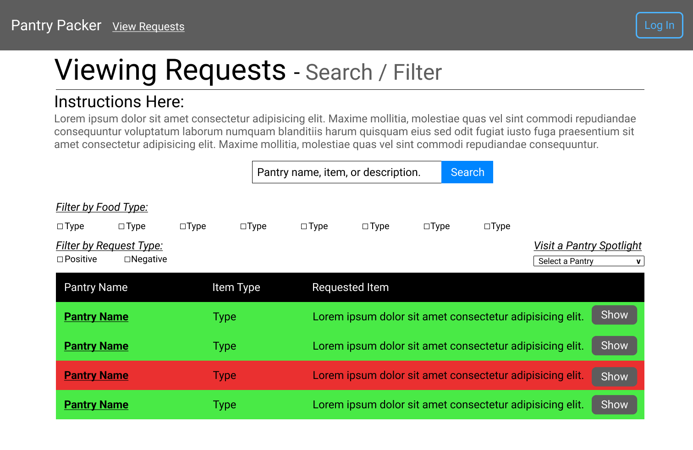
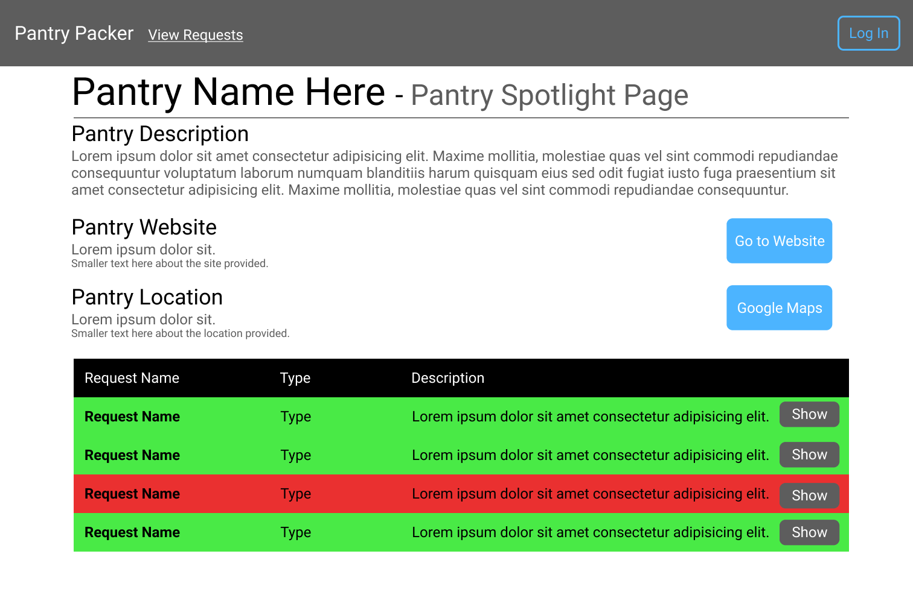

# User Interface Mockups
[< Back to `readme.md`](../../readme.md)

The UI mockups are meant to help drive development of an intuitive and user-friendly interface for the application. These mockups are temporary, and small details on each page may be changed for the final product. Only the pages that include major use cases have been included; pages for logging in and managing the account have been omitted.

## Creating a Request

## Updating a Request

## Deleting a Request

## Viewing a Request

## Searching for a Request

## Viewing a Pantry Spotlight
